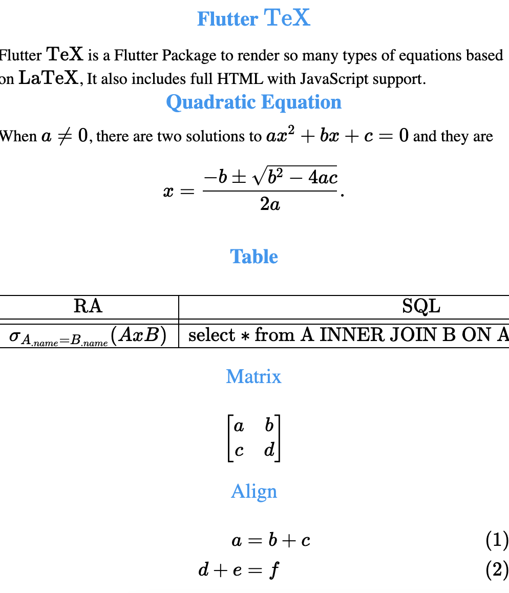

# Using Latex (flutter_text) on Flutter

The latex.dart contains an example of latex code. To install flutter_text on Android:

Add “ android:usesCleartextTraffic="true"” on /android/app/src/main/AndroidManifest.xml

    <application
            android:label="flutter_text"
            android:usesCleartextTraffic="true"     <—————
            android:icon="@mipmap/ic_launcher">

Furthermore, add permissions

    package="com.example.flutter_text">
        <uses-permission android:name="android.permission.INTERNET" />					<—————
        <uses-permission android:name="android.permission.ACCESS_NETWORK_STATE" />	    <—————
        <uses-permission android:name="android.permission.WAKE_LOCK" />					<—————
    <application

on /android/app/build.gradle change the min SDK
    "minSdkVersion 19"

If you obtain the error of “java SDK”. Then, open the app in the android studio. Go to File>Project Structure> project to select android sdk 

On pubspec.yaml

    dependencies:
    flutter:
        sdk: flutter
    flutter_tex: ^4.0.1

ON iOS (/iOS/Runner/Info.plist) add the next key:

    <!DOCTYPE plist PUBLIC "-//Apple//DTD PLIST 1.0//EN" "http://www.apple.com/DTDs/PropertyList-1.0.dtd">
    <plist version="1.0">
    <dict>
        <key>NSAppTransportSecurity</key>
        <dict>
            <key>NSAllowsArbitraryLoads</key> <true/>
        </dict>
        <key>io.flutter.embedded_views_preview</key> <true/> 

ON WEB (/web/index.html)

    <meta charset="UTF-8">
    <title>Flutter TeX</title>
    
    

